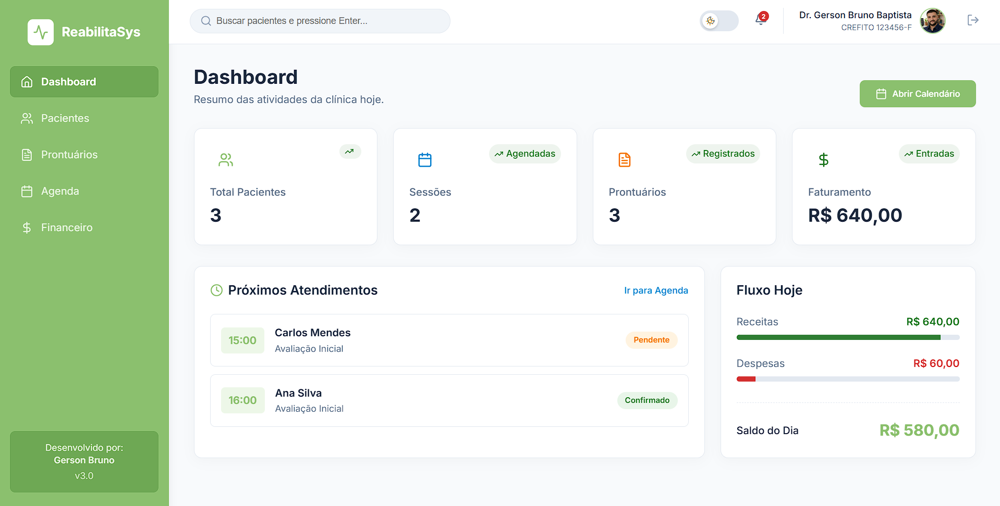

# 🏥 ReabilitaSys

Sistema web completo para gestão de clínicas de fisioterapia.  
Permite controle financeiro, agendamento de pacientes, prontuários, evoluções, alta e gerenciamento de pacientes ativos e inativos.

🔗 Acesse o projeto online: [Clique aqui](https://gerson-bruno.github.io/ReabilitaSys/)

---

## 📸 Preview



---

## 🔐 Acesso ao Sistema

Usuário padrão:
```
admin
```

Senha:
```
123
```

Ou crie um novo usuário diretamente na tela de login.

---

## ✨ Funcionalidades

- 🌙 Modo claro e escuro
- 👤 Edição de foto e dados do profissional
- 📅 Agendamento de pacientes
- 📋 Controle de prontuário (consulta, evolução e alta)
- 💰 Controle financeiro da clínica
- 📊 Gestão de pacientes ativos e inativos
- 🔐 Sistema de autenticação

---

## ⚙️ Tecnologias Utilizadas

- ⚛️ React 19
- 🔷 TypeScript
- ⚡ Vite
- 🧭 React Router DOM
- 🎨 Lucide React (ícones)
- 📏 ESLint

---

## 🚀 Rodando o projeto localmente

### 1️⃣ Clone o repositório
```bash
git clone https://github.com/gerson-bruno/ReabilitaSys.git
```

### 2️⃣ Acesse a pasta do projeto
```bash
cd ReabilitaSys
```

### 3️⃣ Instale as dependências
```bash
npm install
```

### 4️⃣ Execute em ambiente de desenvolvimento
```bash
npm run dev
```

O projeto estará disponível em:

```
http://localhost:5173
```

---

## 🏗️ Build para produção

Gerar versão otimizada:

```bash
npm run build
```

Visualizar build localmente:

```bash
npm run preview
```

---

## 📁 Estrutura do Projeto

Projeto desenvolvido com arquitetura moderna baseada em componentes, utilizando React + TypeScript, com organização modular e foco em escalabilidade.

---

## 📌 Objetivo do Projeto

O ReabilitaSys foi desenvolvido como um sistema completo de gestão para clínicas, simulando um cenário real de uso profissional, com foco em organização, produtividade e experiência do usuário.

---

## 👨‍💻 Autor

Desenvolvido por **Gerson Bruno**
